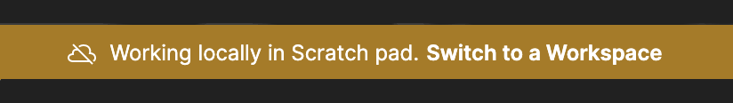

# Postman Scratchpad Banner Fix
### Remove Scratchpad Banner from Postman 8.x.x

# Description
Starting from [Postman](https://www.postman.com/) v8, working locally in scratchpad mode introduces this annoying banner which can't be disabled completely.

Therefore, I've created this repo to solve the problem, I've patched postman files to disable the scratchpad banner

Tested on Postman versions from *`8.1.0`* to *`8.10.0`*

# Install
* Install [node.js](https://nodejs.org/en/download/)
* Clone this repo `git clone https://github.com/3omar-mostafa/Postman-Scratchpad-Banner-Fix.git`
* `cd Postman-Scratchpad-Banner-Fix`
* Run ***`npm install`*** to install dependencies

# Linux
# Usage
## Patch your already installed postman
Run ***`node fix.js -r ${requester_js}`*** , where ***`${requester_js}`*** is Postman file (***`requester.js`***) which renders scratchpad banner

### requester.js path:
It can be found on path like this: ***`${Postman_install_dir}/resources/app/js/requester.js`***

## Download patched postman
You can find downloads for linux and macos at [Releases](https://github.com/3omar-mostafa/Postman-Scratchpad-Banner-Fix/releases)

# MacOS
# Usage
## Patch your already installed postman

* For Postman version `8.0.0` to `8.10.0`
  * Run ***`node fix.js -r ${requester_js}`*** , where ***`${requester_js}`*** is Postman file (***`requester.js`***) which renders scratchpad banner
  * ***`${requester_js}`*** can be found on path like this: ***`${Postman_install_dir}/Contents/Resources/app/js/requester.js`***

* For Postman version `8.11.0` or above
  * Run ***`node fix.js -a ${app_asar}`*** , where ***`${app_asar}`*** is Postman file (***`app.asar`***) which is like a `tar` archive and contains most of postman's files 
  * ***`${app_asar}`*** can be found on path like this: ***`${Postman_install_dir}/Contents/Resources/app.asar`***
  * You can learn more about *`asar`* file format [from here](https://github.com/electron/asar).

## Download patched postman
You can find downloads for linux and macos at [Releases](https://github.com/3omar-mostafa/Postman-Scratchpad-Banner-Fix/releases)

# Windows
# Usage
## Patch your already installed postman
Run ***`node fix.js -a ${app_asar}`*** , where ***`${app_asar}`*** is Postman file (***`app.asar`***) which is like a `tar` archive and contains most of postman's files 

### app.asar path:
It can be found on path like this: ***`%localappdata%\Postman\app-8.10.0\resources\app.asar`***

You can learn more about *`asar`* file format [from here](https://github.com/electron/asar).

## Download patched postman
Windows is not included because its installer is *`exe`* file which I can extract and patch the files, but unfortunately I can not re-create the same installer, but you can still patch you existing installation

# Methodology and Manual Patching
The file which is responsible for displaying scratchpad banner is ***`requester.js`***

I've made three changes to the file (they are redundant and any one of them is enough, but made three for more reliability)

* ***`getWorkingInScratchpadBanner`***
    * Modified this function to automatically close the scratchpad banner instead of creating it, using ***`this.closeBanner()`*** function call

* ***`SHOW_BANNER_IN_SCRATCHPAD`***
    * Modified this constant to equal ***`HIDE_SCRATCHPAD_BANNER`*** instead

* ***`_constants_ScratchpadConstants__WEBPACK_IMPORTED_MODULE_8__["SHOW_BANNER_IN_SCRATCHPAD"]`***
    * Modified this object to return ***`HIDE_SCRATCHPAD_BANNER`*** instead

If you are on windows/macos, you can use [asar](https://github.com/electron/asar#command-line-utility) to extract ***`app.asar`*** and modify ***`requester.js`*** then repack it again

# Notes
This repo use github actions to automate checking for new releases every month, also can run manually for custom version

To do this you should fork this repo and go to Actions tab and enable Github Actions

You can see [this guide](https://docs.github.com/en/actions/managing-workflow-runs/manually-running-a-workflow) to manually run an Action
